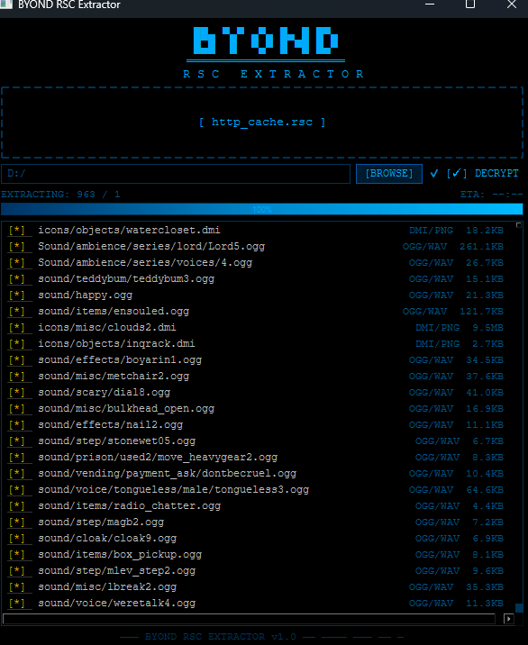

# BYOND RSC Extractor

Extract and decrypt resources from BYOND `.rsc` cache files.

Recovers `.dmi`, `.ogg`, `.png`, `.jpg`, fonts, and other assets from Dream Maker / BYOND cache files.



## Download

**No install required.** Grab the latest standalone executable from [Releases](https://github.com/Daelso/byond-rsc-extractor/releases):

- **Windows:** `BYOND_RSC_Extractor_Windows.exe`
- **Linux:** `BYOND_RSC_Extractor_Linux`

## Usage

### GUI (recommended)

Run the executable, drop a `.rsc` file onto the window (or click to browse), and watch it extract. Files are sorted into clean `decrypted/` and `encrypted/` folders at your chosen output location. Decryption is enabled by default.

### CLI

For advanced users or batch processing:

```bash
# Extract one file
python3 extract_rsc.py sample_rscs/byond.rsc

# Extract with decryption
python3 extract_rsc.py --decrypt-encrypted -o extracted sample_rscs/byond.rsc

# Multiple files at once
python3 extract_rsc.py -o extracted path/to/a.rsc path/to/b.rsc
```

CLI requires Python 3.10+ and optionally a C compiler for seed recovery.

| Flag | Description |
|------|-------------|
| `-o, --out` | Output directory (default: `extracted`) |
| `--decrypt-encrypted` | Attempt decryption of encrypted entries |
| `--skip-encrypted` | Don't write entries that are still encrypted |
| `--include-metadata` | Include DDMI metadata records (type `0x0C`) that are skipped by default |
| `--no-recursive` | Disable nested RAD stream extraction |
| `--quiet` | Summary-only output |

## Features

- Parses BYOND RAD/RSC streams and writes files using embedded names
- Recursively extracts nested RAD streams found in cache archives
- Validates extracted files against known signatures (PNG, OGG, WAVE, MIDI, JPEG, TTF/OTF)
- Decrypts entries marked with BYOND's `0x80` encryption flag via brute-forced seed recovery
- GUI shows real-time progress bar, ETA, and scrolling file list with per-file status

## How Decryption Works

1. Encrypted entries are detected via type bit `0x80`
2. For known file types, the expected plaintext prefix and first 16 ciphertext bytes are fed to `seed_finder`
3. `seed_finder` brute-forces candidate seeds satisfying the prefix constraint
4. Candidates are applied with BYOND's state step/XOR transform
5. Decryption is accepted only if signature checks pass

Not all encrypted entries will decrypt — seed recovery depends on known file prefixes.

## Troubleshooting

- **"Could not build/find seed helper"** — Install a C compiler, or place a compiled `seed_finder` binary next to `extract_rsc.py`
- **Many `.enc` files** — Expected when seeds can't be recovered for those entries
- **Hash-like names (for example `8ef76a...dmi`)** — Those are BYOND cache keys; original source paths are often not stored in `.rsc`
- **Need old `.bin` metadata dumps** — Run CLI with `--include-metadata` to extract DDMI metadata entries
- **SmartScreen warning on Windows** — The `.exe` is unsigned; click "Run anyway"

## Legal

Only extract assets you are authorized to inspect or archive. Respect game licenses, server policies, and intellectual property restrictions.
